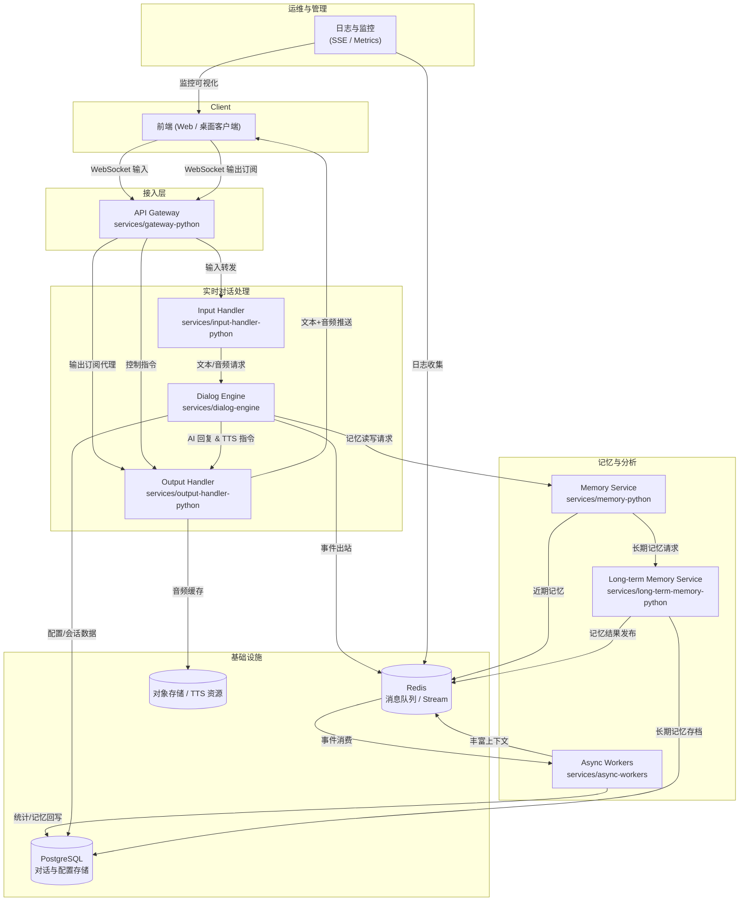

# 项目后端架构图

下图展示了 Free Agent Vtuber 项目后端服务之间的主要交互关系，涵盖实时会话链路、记忆存储以及运维管理通道。

```mermaid
graph TD
  subgraph Client["Client"]
    FE["前端 (Web / 桌面客户端)"]
  end

  subgraph GatewayLayer["接入层"]
    APIGW["API Gateway<br/>services/gateway-python"]
  end

  subgraph RealtimePipeline["实时对话处理"]
    IH["Input Handler<br/>services/input-handler-python"]
    DE["Dialog Engine<br/>services/dialog-engine"]
    OH["Output Handler<br/>services/output-handler-python"]
  end

  subgraph MemoryServices["记忆与分析"]
    MEM["Memory Service<br/>services/memory-python"]
    LTM["Long-term Memory Service<br/>services/long-term-memory-python"]
    AW["Async Workers<br/>services/async-workers"]
  end

  subgraph Infrastructure["基础设施"]
    Redis[("Redis<br/>消息队列 / Stream")]
    Postgres[("PostgreSQL<br/>对话与配置存储")]
    ObjectStore[("对象存储 / TTS 资源")]
  end

  subgraph Ops["运维与管理"]
    Observability["日志与监控<br/>(SSE / Metrics)"]
  end

  FE -- "WebSocket 输入" --> APIGW
  FE -- "WebSocket 输出订阅" --> APIGW

  APIGW -- "输入转发" --> IH
  APIGW -- "输出订阅代理" --> OH
  APIGW -- "控制指令" --> OH

  IH -- "文本/音频请求" --> DE
  DE -- "AI 回复 & TTS 指令" --> OH
  OH -- "文本+音频推送" --> FE

  DE -- "记忆读写请求" --> MEM
  MEM -- "近期记忆" --> Redis
  MEM -- "长期记忆请求" --> LTM
  LTM -- "记忆结果发布" --> Redis
  DE -- "事件出站" --> Redis

  Redis -- "事件消费" --> AW
  AW -- "统计/记忆回写" --> Postgres
  AW -- "丰富上下文" --> Redis

  DE -- "配置/会话数据" --> Postgres
  LTM -- "长期记忆存档" --> Postgres
  OH -- "音频缓存" --> ObjectStore

  Observability -- "日志收集" --> Redis
  Observability -- "监控可视化" --> FE

```

> 更新于：2025-10-02
