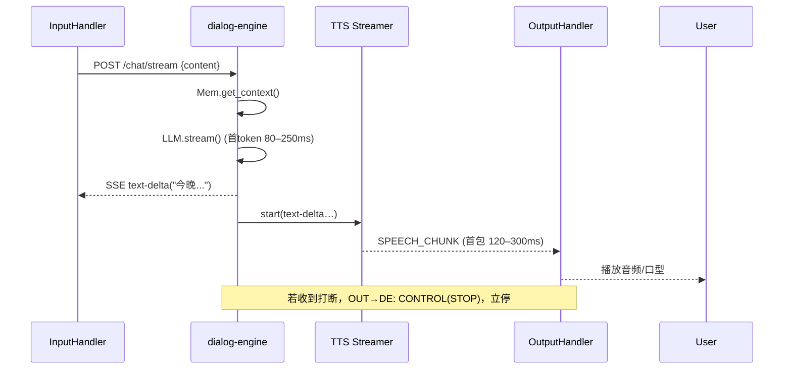

太好了。我给你的“编码 AI”准备了一份**可执行的技术设计文档（TDD）**，覆盖架构、接口契约、目录结构、数据模型、待办拆分、里程碑与验收标准。把这份文档贴给它即可开始评审与实现。

---

# Free-Agent-Vtuber — 同步主链路 + 异步扩展层 重构设计（TDD）

## 0. 目标与范围

**目标（本次迭代）**

1. 保留独立 `input-handler` 与 `output-handler`。
2. 合并 `ASR / LLM / TTS / Memory(短期)` 为单进程 **`dialog-engine`**，主链路改为**同步、流式、可打断**。
3. 保留 Redis，用 **Redis Streams** 承载**异步扩展**（长期记忆写入、观测、插件）。
4. 保持现有系统可运行；通过 **Feature Flag** 渐进切换，无停机。
5. （可选，先不实现）预留 `adapters.in/out` 公共通道与 `io-bridge`。

**不在本次范围**

* 新增 3D 渲染、视觉模块、复杂插件生态。
* 重写前端或管理面。
* 改动现有对外 HTTP 网关形态。

---

## 1. 总体架构

```mermaid
flowchart LR
  User((主播/观众))
  IN[Input Handler]
  OUT[Output Handler]

  subgraph CORE[dialog-engine（核心同步链路）]
    ASR[ASR (可选)]
    LLM[LLM 对话]
    MEM[短期记忆 (同步)]
    TTS[TTS (流式/可打断)]
  end

  subgraph ASYNC[异步扩展层]
    BUS[(Redis Streams)]
    LTM[长期记忆写入/Embedding/摘要]
    ANALYTICS[观测与指标]
    PLUGINS[插件(情感/工具等)]
  end

  User -->|语音/弹幕/热键| IN
  IN -->|规范化请求(同步)| ASR
  IN -->|文本直达| LLM
  ASR -->|转写文本| LLM
  LLM <-->|上下文| MEM
  LLM -->|流式文本| TTS
  TTS -->|音频帧/viseme| OUT
  OUT -->|音视频/字幕/控制| User

  LLM -.事件.-> BUS
  MEM -.事件.-> BUS
  TTS -.事件.-> BUS
  BUS --> LTM
  BUS --> ANALYTICS
  BUS --> PLUGINS
```

---

## 2. 运行与切换策略

### 2.1 Feature Flags（环境变量）

* `ENABLE_SYNC_CORE=true` —— 启用同步主链路（IN→dialog-engine→OUT）。
* `ENABLE_ASYNC_EXT=true` —— 启用异步扩展（LTM/Analytics/Plugins→Streams）。
* `ENABLE_ADAPTER_BRIDGE=false` —— 适配器公共通道与 `io-bridge`（可选，默认关闭）。
* `ENABLE_LTM_INLINE=false` —— 需要时**同步读取**LTM（默认关闭，仅在触发条件下使用）。
* `SYNC_TTS_STREAMING=true` —— TTS 流式输出。
* `SYNC_TTS_BARGE_IN=true` —— 允许打断当前播报。

### 2.2 渐进切换

1. 保持旧链路运行。
2. 启动 `dialog-engine`，把 `input-handler` 切到 `ENABLE_SYNC_CORE=true`，优先走同步。
3. `output-handler` 接收 `dialog-engine` 的流式 TTS；旧的 `ai_responses/tts_requests` 保留一段时间作为回退。
4. 验证稳定后，逐步关闭旧队列的生产。

---

## 3. 组件与接口契约

### 3.1 Input Handler → dialog-engine（同步调用）

* **协议**：HTTP/1.1 + SSE（Server-Sent Events）或 gRPC streaming（二选一，默认 SSE）。
* **Endpoint**：`POST /chat/stream`
* **请求 JSON**：

```json
{
  "sessionId": "live-001",
  "turn": 42,
  "type": "TEXT|ASR_FINAL|COMMAND",
  "content": "今晚玩什么？",
  "meta": { "lang": "zh", "emotionHint": null }
}
```

* **响应（SSE 事件流）**：

  * `text-delta`: `{"content":"……分片文本……","eos":false}`
  * `viseme`: `{"phoneme":"AA", "startMs":120, "durMs":80}`
  * `control`: `{"action":"HINT_TTS_START"}`
  * `done`: `{"stats":{"ttft_ms":130, "tokens":57}}`

> 若采用 gRPC：定义 `ChatStream(request) returns (stream ChatEvent)`，事件类型同上。

### 3.2 dialog-engine → Output Handler（TTS 流）

* **协议**：本地环回 WebSocket 或 gRPC streaming。
* **消息**：

```json
{
  "type": "SPEECH_CHUNK",
  "sessionId": "live-001",
  "seq": 17,
  "pcm": "<base64>",
  "viseme": {"AA":0.7,"M":0.1},
  "ts": 1736900000
}
```

* **打断**：Output 可随时发送 `{"type":"CONTROL","action":"STOP"}` 回 dialog-engine，后者必须**立即**停止继续推送音频。

### 3.3 短期记忆（同步）

* **存储**：SQLite（WAL），表 `turns(sessionId, turn, role, text, ts)`，保留最近 N 轮（默认 20）。
* **接口（内部）**：`Mem.get_context(sessionId, k=20) -> List[Turn]`；`Mem.append(turn)`。

### 3.4 异步扩展（Redis Streams）

* **Streams**：

  * `events.ltm` —— LTM 写入任务（摘要、embedding）
  * `events.analytics` —— 观测与指标
  * `events.plugins` —— 插件事件（情感分析、工具调用等）
* **Outbox 模式**（推荐）：`dialog-engine` 将事件先写入本地表 `outbox_events(id, type, payload, created_at, delivered)`，后台 worker 批量 `XADD`，成功后打 `delivered=1`。
* **消费者组**（示例）：

  * `events.ltm`：`group ltm-workers`
  * `events.analytics`：`group a11y-workers`
* **事件载荷示例**：

```json
{
  "correlationId": "live-001#42",
  "sessionId": "live-001",
  "turn": 42,
  "type": "LtmWriteRequested",
  "payload": {
    "text": "今晚玩什么？",
    "reply": "今晚我们尝试……",
    "vectorize": true
  },
  "ts": 1736900000
}
```

### 3.5 （可选）适配器公共通道与 io-bridge

* **Pub/Sub 频道**：

  * `adapters.in` —— 外部输入 → 系统
  * `adapters.out` —— 系统输出 → 外部
* **统一信封**：

```json
{
  "v": 1,
  "type": "CHAT|ASR_PARTIAL|ASR_FINAL|HOTKEY|GAME_EVENT|RENDER_TEXT|RENDER_OVERLAY|CONTROL",
  "sessionId": "live-001",
  "content": "hello",
  "meta": {},
  "ts": 1736900000
}
```

* **io-bridge 职责**：

  * 监听 `adapters.in` → 转为内部标准输入（入队或直调 `/chat/stream`）。
  * 监听系统输出（如文本/TTS意图）→ 转发到 `adapters.out`。

> **当前迭代不实现**，留接口与 Flag 即可。

---

## 4. 目录结构（建议）

```
Free-Agent-Vtuber/
├─ services/
│  ├─ input-handler/
│  │  └─ ...（保留）
│  ├─ output-handler/
│  │  └─ ...（保留）
│  ├─ dialog-engine/
│  │  ├─ app.py                # HTTP/SSE 或 gRPC 入口
│  │  ├─ chat_service.py       # 调用链：短期记忆→LLM→TTS
│  │  ├─ memory_shortterm.py   # SQLite(WAL)
│  │  ├─ tts_streamer.py       # 流式/打断
│  │  ├─ asr_client.py         # 可空
│  │  ├─ ltm_outbox.py         # Outbox→Streams
│  │  ├─ config.py
│  │  └─ tests/
│  ├─ async-workers/
│  │  ├─ ltm_worker.py         # XREADGROUP 消费 events.ltm
│  │  ├─ analytics_worker.py   # 消费 events.analytics
│  │  └─ plugins_worker.py     # 消费 events.plugins
│  └─ io-bridge/               # 可选，默认不启
│     └─ bridge.py
├─ infra/
│  ├─ docker-compose.yml
│  ├─ docker-compose.dev.yml
│  └─ redis.conf
├─ docs/
│  └─ ADR-0001-sync-core.md    # 本文档/或链接
└─ .env.example
```

---

## 5. 数据模型（SQLite）

```sql
-- turns: 短期记忆（保留最近 N 轮）
CREATE TABLE IF NOT EXISTS turns(
  sessionId TEXT,
  turn      INTEGER,
  role      TEXT CHECK(role IN ('user','assistant')),
  text      TEXT,
  ts        INTEGER,
  PRIMARY KEY(sessionId, turn, role)
);

-- outbox_events: 事件外发盒
CREATE TABLE IF NOT EXISTS outbox_events(
  id         INTEGER PRIMARY KEY AUTOINCREMENT,
  type       TEXT,
  payload    TEXT,          -- JSON
  created_at INTEGER,
  delivered  INTEGER DEFAULT 0
);

-- 简单清理：仅保留每 session 最近 20 轮
```

---

## 6. 时序（关键路径）

### 6.1 文本 → 语音（核心同步）



---

## 7. 配置与参数（建议默认）

* **短期记忆上下文窗口**：`MEM_RECENT_TURNS=20`
* **TTS**：`TTS_CHUNK_MS=40`，`TTS_MAX_QUEUE=2`，`BARGE_IN=true`
* **背压**：`INBOUND_MAX=5`（Input 内部有界队列，满则合并/丢增量）
* **Redis Streams**：`EVENT_MAXLEN=100000 ~ 1e5`（近似），`XREADGROUP BLOCK=2000ms`
* **超时**：`CHAT_RESPONSE_DEADLINE_MS=30000`，`TTS_START_DEADLINE_MS=1200`

---

## 8. 测试计划（pytest + e2e）

### 8.1 单元/集成

* `memory_shortterm_test.py`：最近 N 轮裁剪、并发写入一致性（WAL）。
* `chat_service_test.py`：给定上下文 → 生成流式文本片段（模拟 LLM）。
* `tts_streamer_test.py`：按 40ms 切片、收到 STOP 立即停止（<100ms）。
* `ltm_outbox_test.py`：写入 outbox → worker 推送 Streams → 标记 delivered。

### 8.2 端到端（本地）

* 起 `dialog-engine`（mock LLM/TTS，返回固定流）。
* `input-handler` POST 文本 → `output-handler` 收到音频片段（mock），断言**首音延迟 < 800ms**。
* 发送 STOP，断言后续不再收到片段。

---

## 9. 里程碑与验收

* **M1（Day 2–3）**：`dialog-engine` 联通；文本→TTS 流式打通；本地 e2e 首音延迟 **P95 < 800ms**。
* **M2（Day 4–5）**：LTM/Analytics 事件改用 Redis Streams（Outbox）；旧总线路径保留但默认关闭。
* **M3（下周）**：（可选）按需触发同步 LTM 召回；默认 Flag 仍为 `false`。
* **验收**：连续两场 1h 直播无致命错误；日志包含 `correlationId`；e2e 指标稳定。

---

## 10. 开发任务拆分（可直接建 Issue）

1. **SVC-001** 新增 `services/dialog-engine` 基础骨架（HTTP SSE + 健康检查）。
2. **SVC-002** `memory_shortterm.py` + SQLite(WAL) 集成，最近 N 轮上下文拼接。
3. **SVC-003** `chat_service.py`：整合短期记忆 → LLM 流式 → 事件投递（Outbox）。
4. **SVC-004** `tts_streamer.py`：流式/打断；与 Output 的 WS/gRPC 通道。
5. **SVC-005** `ltm_outbox.py` + `async-workers/ltm_worker.py`（XREADGROUP）。
6. **SVC-006** `analytics_worker.py`（消费 events.analytics，打印指标）。
7. **SVC-007** 修改 `input-handler`：支持调用 `/chat/stream`（Flag 控制）。
8. **SVC-008** 修改 `output-handler`：接收 `SPEECH_CHUNK` 并播放（Flag 控制）。
9. **SVC-009** docker-compose 新增 `dialog-engine`、`async-workers` 服务与环境变量。
10. **SVC-010** e2e 测试脚本：首音延迟、打断、背压测试。

（可选）
11\) **SVC-011** 预留 `io-bridge` 与 `adapters.in/out`（不默认启动）。

---

## 11. 风险与回退

* **风险**：同步链路异常导致无声音/卡顿。
* **回退**：将 `ENABLE_SYNC_CORE=false`，恢复旧的 Redis 队列主链路。
* **监控**：输出首包超时>1.2s、端到端>800ms 打警告；日志包含 `correlationId=sessionId#turn`。

---

## 12. 备注（实现建议）

* **优先选 SSE** 实现流式文本（简单、无额外依赖）；TTS → Output 用本机 WebSocket。
* **TTS 模块** 支持“句边界”播放（逗号/句号停顿），这样更容易做打断。
* **并发模型**：`asyncio` + 有界队列；收到 STOP 时**立刻清空**队列并终止当前合成。
* **数据库**：SQLite 打开 WAL 模式；谨慎做 VACUUM；短期记忆表定期裁剪。

---

> 本文档交给“编码 AI”后，它可以据此：
>
> * 新增 `dialog-engine` 服务（HTTP SSE / gRPC 二选一）；
> * 改造 Input/Output 的少量调用点；
> * 接入 Redis Streams 的 Outbox/Worker；
> * 写完基础测试与 e2e；
> * 通过 Flag 渐进切换并验收延迟指标。

需要我把这份 TDD 同时输出成一份 **`docs/ADR-0001-sync-core.md`**（Markdown 版本，带少量示例代码片段）吗？如果你点头，我就把它整理成可直接入库的文档稿。
