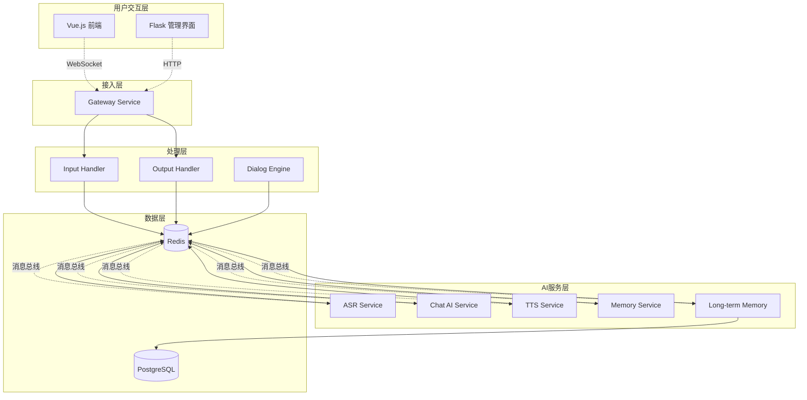

# Free-Agent-Vtuber 组件关系与数据流文档

## 文档概述

本文档详细描述 Free-Agent-Vtuber 系统中各个组件之间的关系、数据流向、消息契约以及交互模式。系统采用事件驱动架构，通过 Redis 消息总线实现组件间的松耦合通信。

## 系统组件概览

### 组件分类

#### 1. 接入层组件
- **Gateway Service**: API 网关和 WebSocket 管理
- **Frontend**: Vue.js 前端应用
- **Manager**: Flask 管理界面

#### 2. 处理层组件
- **Input Handler**: 输入数据处理和归一化
- **Output Handler**: 输出数据格式化和传输
- **Dialog Engine**: 对话流程控制

#### 3. 核心服务组件
- **ASR Service**: 自动语音识别
- **Chat AI Service**: AI 对话生成
- **TTS Service**: 文本转语音
- **Memory Service**: 短期记忆管理
- **Long-term Memory Service**: 长期记忆管理

#### 4. 基础设施组件
- **Redis**: 消息总线和缓存
- **PostgreSQL**: 向量数据库

## 详细组件关系图



## 消息流设计

### 消息队列 (Redis List)

#### 1. `asr_tasks` - 语音识别任务队列
**生产者**: Gateway Service
**消费者**: ASR Service
**消息格式**:
```json
{
  "task_id": "uuid-string",
  "audio_file_path": "/tmp/aivtuber_tasks/{task_id}/input.wav",
  "timestamp": "2025-01-11T10:30:00Z",
  "source": "gateway"
}
```

#### 2. `user_input_queue` - 用户输入处理队列
**生产者**: Input Handler Service
**消费者**: Memory Service
**消息格式**:
```json
{
  "task_id": "uuid-string",
  "task_data": {
    "content": "用户输入的文本内容",
    "type": "text|audio",
    "metadata": {
      "source": "asr|direct_text",
      "confidence": 0.95,
      "language": "zh-CN"
    }
  },
  "timestamp": "2025-01-11T10:30:00Z"
}
```

#### 3. `tts_requests` - 语音合成请求队列
**生产者**: Chat AI Service
**消费者**: TTS Service
**消息格式**:
```json
{
  "task_id": "uuid-string",
  "text": "AI回复的文本内容",
  "voice_config": {
    "voice": "zh-CN-XiaoxiaoNeural",
    "rate": "+0%",
    "pitch": "+0Hz"
  },
  "output_path": "/tmp/aivtuber_tasks/{task_id}/output.wav"
}
```

### 发布订阅频道 (Redis Pub/Sub)

#### 1. `asr_results` - ASR 识别结果
**发布者**: ASR Service
**订阅者**: Input Handler Service
**消息格式**:
```json
{
  "task_id": "uuid-string",
  "status": "finished|failed",
  "result": {
    "text": "识别出的文本内容",
    "confidence": 0.95,
    "language": "zh-CN"
  },
  "error": "错误信息(如果失败)",
  "timestamp": "2025-01-11T10:30:00Z"
}
```

#### 2. `memory_updates` - 记忆更新事件
**发布者**: Memory Service
**订阅者**: Chat AI Service, Long-term Memory Service
**消息格式**:
```json
{
  "task_id": "uuid-string",
  "action": "add|update|retrieve",
  "memory_content": {
    "user_input": "用户输入内容",
    "context": ["历史对话上下文"],
    "metadata": {
      "emotion": "neutral",
      "topic": "conversation"
    }
  },
  "timestamp": "2025-01-11T10:30:00Z"
}
```

#### 3. `ai_responses` - AI 回复事件
**发布者**: Chat AI Service
**订阅者**: Output Handler Service, Long-term Memory Service
**消息格式**:
```json
{
  "task_id": "uuid-string",
  "response": {
    "text": "AI生成的回复内容",
    "emotion": "happy|sad|neutral",
    "actions": ["action1", "action2"],
    "metadata": {
      "model": "gpt-4",
      "tokens_used": 150,
      "confidence": 0.9
    }
  },
  "timestamp": "2025-01-11T10:30:00Z"
}
```

#### 4. `task_response:{task_id}` - 任务完成响应
**发布者**: TTS Service, Output Handler Service
**订阅者**: Gateway Service (按 task_id 订阅)
**消息格式**:
```json
{
  "task_id": "uuid-string",
  "status": "success|error",
  "result": {
    "text": "AI回复文本",
    "audio_present": true,
    "audio_path": "/tmp/aivtuber_tasks/{task_id}/output.wav",
    "total_chunks": 5
  },
  "error": "错误信息(如果失败)",
  "timestamp": "2025-01-11T10:30:00Z"
}
```

## 端到端数据流分析

### 场景1: 语音输入完整流程

```
1. 前端录音 → WebSocket连接Gateway
   前端: WebSocket /ws/input
   数据: 音频流 (audio/webm)

2. Gateway → Input Handler
   处理: 文件保存，任务创建

3. Gateway → ASR任务队列
   操作: LPUSH asr_tasks
   数据: {"task_id": "xxx", "audio_file_path": "/tmp/xxx/input.wav"}

4. ASR Service处理
   操作: RPOP asr_tasks
   处理: 音频转文字

5. ASR → Input Handler
   频道: asr_results (pub/sub)
   数据: {"task_id": "xxx", "status": "finished", "result": {"text": "识别结果"}}

6. Input Handler归一化
   处理: 创建标准用户输入任务
   操作: LPUSH user_input_queue
   数据: {"task_id": "xxx", "task_data": {"content": "识别结果", "type": "audio"}}

7. Memory Service处理
   操作: RPOP user_input_queue
   处理: 记忆检索和上下文构建

8. Memory → Chat AI
   频道: memory_updates (pub/sub)
   数据: {"task_id": "xxx", "action": "add", "memory_content": {...}}

9. Chat AI生成回复
   处理: LLM调用，回复生成

10. Chat AI → TTS + Output Handler
    频道: ai_responses (pub/sub)
    操作: LPUSH tts_requests
    数据: AI回复内容

11. TTS Service处理
    操作: RPOP tts_requests
    处理: 文字转语音

12. TTS → Gateway
    频道: task_response:{task_id} (pub/sub)
    数据: {"task_id": "xxx", "status": "success", "result": {...}}

13. Gateway → 前端
    连接: WebSocket /ws/output/{task_id}
    传输: 文本 + 音频流
```

### 场景2: 文本输入简化流程

```
1. 前端文本输入 → Gateway
2. Gateway → Input Handler → user_input_queue
3. Memory Service → memory_updates
4. Chat AI → ai_responses + tts_requests
5. TTS → task_response:{task_id}
6. Gateway → 前端 (文本 + 音频)
```

## 组件交互模式

### 1. 同步交互模式
**使用场景**: WebSocket 实时通信
**组件**: Frontend ↔ Gateway
**特点**: 实时双向通信，状态同步

### 2. 异步队列模式
**使用场景**: 任务处理
**组件**: Gateway → ASR, Memory → Chat AI
**特点**: 解耦处理，可扩展性好

### 3. 事件订阅模式
**使用场景**: 状态通知
**组件**: ASR → Input Handler, Memory → Chat AI
**特点**: 一对多通知，松耦合

### 4. 混合模式
**使用场景**: 复杂业务流程
**组件**: Chat AI (订阅 memory_updates + 发布 ai_responses + 队列 tts_requests)
**特点**: 同时使用多种交互模式

## 错误处理和重试机制

### 组件级错误处理

#### 1. 队列任务失败
```python
# 伪代码示例
def process_task(task):
    try:
        result = handle_task(task)
        publish_success(result)
    except RetryableError as e:
        # 重新入队，带重试计数
        retry_task(task, retry_count + 1)
    except FatalError as e:
        # 发布失败事件
        publish_error(task_id, error_message)
```

#### 2. 发布订阅失败
```python
def publish_with_retry(channel, message, max_retries=3):
    for attempt in range(max_retries):
        try:
            redis_client.publish(channel, message)
            break
        except ConnectionError:
            if attempt == max_retries - 1:
                # 记录失败，触发告警
                log_publish_failure(channel, message)
```

### 端到端超时处理

#### 超时配置
```yaml
timeouts:
  asr_processing: 30s      # ASR处理超时
  ai_generation: 60s       # AI生成超时
  tts_synthesis: 20s       # TTS合成超时
  total_request: 120s      # 端到端请求超时
```

#### 超时处理流程
1. Gateway 设置总超时定时器
2. 各服务设置组件超时
3. 超时后发布错误事件
4. Gateway 返回超时响应

## 数据一致性保证

### 1. 任务状态一致性
- 每个任务有唯一 task_id
- 状态变更通过事件同步
- 失败任务自动清理

### 2. 内存数据一致性
- 短期记忆与长期记忆同步
- 记忆更新事件确保一致性
- 定期数据校验和修复

### 3. 临时文件一致性
- 任务完成后自动清理
- 定期清理孤儿文件
- 磁盘空间监控

## 性能优化策略

### 1. 消息队列优化
- 合理设置队列长度限制
- 优先级队列支持
- 批量处理机制

### 2. 缓存策略
- ASR 结果缓存
- 记忆检索缓存
- 模型推理缓存

### 3. 连接池管理
- Redis 连接池
- 数据库连接池
- HTTP 连接复用

## 扩展性设计

### 1. 水平扩展
```yaml
# 服务实例扩展示例
version: '3.8'
services:
  asr:
    scale: 3  # ASR服务3个实例
  chat-ai:
    scale: 2  # Chat AI服务2个实例
```

### 2. 新服务接入
1. 实现标准消息接口
2. 注册到服务发现
3. 配置消息路由
4. 添加健康检查

### 3. 协议版本管理
```json
{
  "version": "v1.0",
  "task_id": "xxx",
  "data": {...}
}
```

## 监控和调试

### 1. 消息流监控
- 队列长度监控
- 消息处理延迟
- 错误率统计

### 2. 组件健康监控
- 服务状态检查
- 资源使用监控
- 响应时间统计

### 3. 分布式链路追踪
```json
{
  "trace_id": "global-trace-id",
  "span_id": "component-span-id",
  "parent_span_id": "parent-span-id",
  "component": "asr-service",
  "operation": "process_audio",
  "timestamp": "2025-01-11T10:30:00Z"
}
```

## 测试策略

### 1. 单元测试
- 各组件独立测试
- Mock 外部依赖
- 消息格式验证

### 2. 集成测试
- 组件间交互测试
- 端到端流程测试
- 错误场景测试

### 3. 压力测试
- 并发请求测试
- 队列积压测试
- 资源极限测试

---

**文档版本**: 1.0
**创建日期**: 2025-09-20
**维护者**: AI Architecture Team