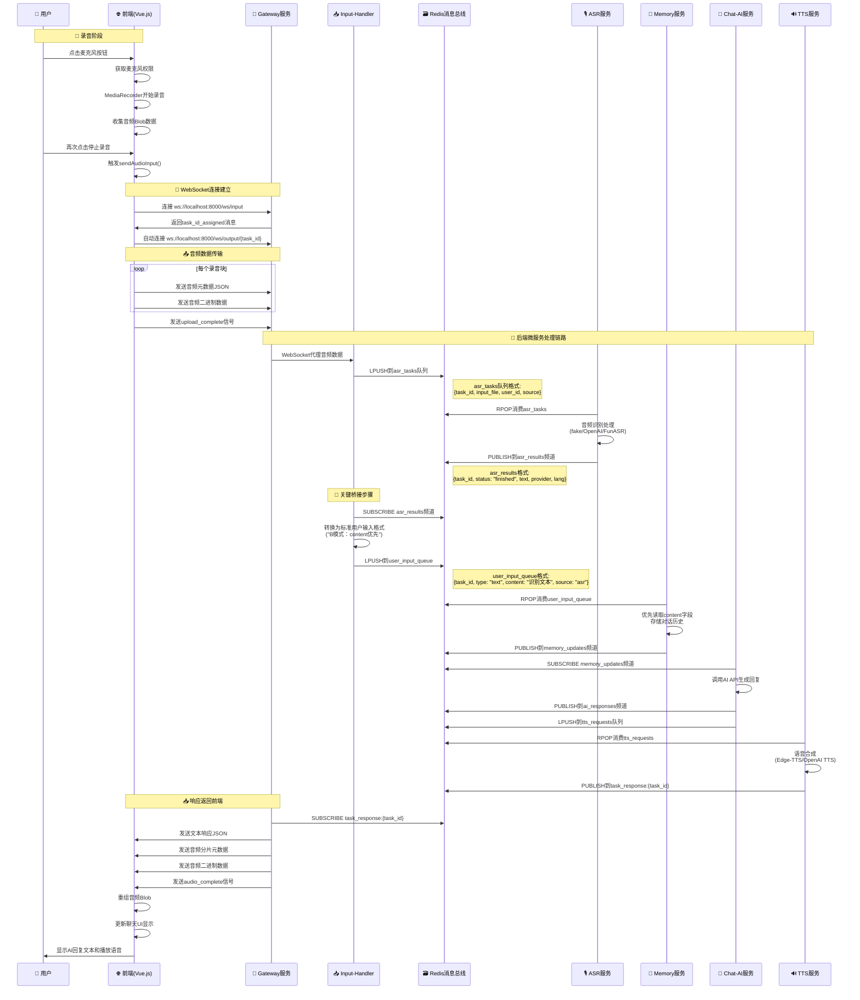

# Free-Agent-Vtuber 语音交互流程分析

## 概述

本文档详细分析用户在前端开启麦克风并发送语音后，前后端及后端各个微服务模块之间的完整信息流动过程。

## 系统架构流程图



## 详细流程分析

### 📱 前端语音录制流程

#### 1. 用户交互触发
- 用户点击麦克风按钮 (`ChatInterface.vue:76`)
- 调用 `toggleRecording()` 方法 (`ChatInterface.vue:169`)  
- 触发 `useApi.js` 中的 `startRecording()` (`useApi.js:401`)

#### 2. 录音初始化
```javascript
// useApi.js:416-422
const stream = await navigator.mediaDevices.getUserMedia({ audio: true });
recorder.value = new MediaRecorder(stream, { mimeType: 'audio/webm;codecs=opus' });
```
- 请求麦克风权限
- 创建 MediaRecorder 实例
- 设置录音格式为 `audio/webm;codecs=opus`

#### 3. 录音数据收集
```javascript
// useApi.js:424-428
recorder.value.ondataavailable = (event) => {
    recordedAudioChunks.value.push(event.data);
};
```
- 录音数据以 Blob 形式存储在 `recordedAudioChunks` 数组中

### 🔄 WebSocket 连接与数据传输

#### 4. 停止录音并发送
- 用户再次点击按钮或录音完成触发 `stopRecording()` (`useApi.js:469`)
- `MediaRecorder.onstop` 事件触发，调用 `sendAudioInput()` (`useApi.js:481`)

#### 5. 建立 WebSocket 连接
```javascript
// useApi.js:69-158
const connectInput = () => {
    inputWs.value = new WebSocket(wsInputUrl); // ws://localhost:8000/ws/input
}
```
- 前端连接到 Gateway 的输入 WebSocket (`/ws/input`)
- Gateway 返回 `task_id_assigned` 消息，包含任务ID
- 同时自动连接输出 WebSocket (`/ws/output/{task_id}`)

#### 6. 音频数据分片传输
```javascript
// useApi.js:523-547
for (let i = 0; i < chunksToSend.length; i++) {
    // 发送元数据
    const metadata = { type: "audio", chunk_id: i, action: "data_chunk" };
    inputWs.value.send(JSON.stringify(metadata));
    
    // 发送二进制音频数据
    inputWs.value.send(chunk);
}
```

### 🌐 后端服务间消息流动

#### 7. Gateway → Input-Handler
**Gateway 服务** (`services/gateway-python/main.py`):
- 接收 WebSocket 音频数据
- 将音频文件写入临时存储
- 通过 WebSocket 代理转发到 Input-Handler

#### 8. Input-Handler → ASR 队列
**Input-Handler 服务** (`services/input-handler-python/main.py`):
- 接收来自 Gateway 的音频文件
- 生成 ASR 任务并推送到 Redis `asr_tasks` 队列:
```json
{
    "task_id": "uuid",
    "input_file": "/tmp/audio_file.webm", 
    "user_id": "anonymous",
    "source": "websocket"
}
```

#### 9. ASR 服务处理
**ASR 服务** (`services/asr-python/`):
- 从 `asr_tasks` 队列消费任务
- 音频识别处理（支持 fake/OpenAI Whisper/FunASR）
- 发布识别结果到 `asr_results` 频道:
```json
{
    "task_id": "uuid",
    "status": "finished",
    "text": "识别到的文字内容",
    "provider": "fake|openai_whisper|funasr_local",
    "lang": "zh"
}
```

#### 10. Input-Handler 桥接 ⭐️
**Input-Handler 的 ASR 桥接功能**（系统关键节点）:
- 订阅 `asr_results` 频道
- 将 ASR 结果转换为标准用户输入格式
- 推送到 `user_input_queue` 队列（**关键桥接步骤**）:
```json
{
    "task_id": "沿用ASR task_id",
    "type": "text", 
    "content": "识别文本内容",
    "source": "asr",
    "meta": {
        "from_channel": "asr_results",
        "provider": "fake|openai_whisper|funasr_local"
    }
}
```

#### 11. Memory → Chat-AI → TTS 链路
**Memory 服务**:
- 消费 `user_input_queue`，优先读取 `content` 字段
- 存储用户对话历史
- 发布到 `memory_updates` 频道

**Chat-AI 服务**:
- 订阅 `memory_updates`
- 调用 AI API 生成回复
- 同时发布到 `ai_responses` 频道和推送到 `tts_requests` 队列

**TTS 服务**:
- 消费 `tts_requests` 队列
- 语音合成（Edge-TTS/OpenAI TTS）
- 发布结果到 `task_response:{task_id}` 频道

### 📤 响应返回前端

#### 12. Output WebSocket 数据流
**Gateway Output WebSocket**:
- 订阅 `task_response:{task_id}` 频道
- 接收到文本和音频响应
- 通过 WebSocket 发送给前端:

```javascript
// 文本响应
{
    "status": "success",
    "task_id": "uuid",
    "content": "AI回复文本", 
    "audio_present": true
}

// 音频分片
{
    "type": "audio_chunk",
    "chunk_id": 0,
    "total_chunks": 3
}
// + 二进制音频数据

// 音频完成
{
    "type": "audio_complete",
    "task_id": "uuid"
}
```

#### 13. 前端渲染响应
**前端处理** (`ChatInterface.vue`):
- `receivedText` watcher 检测到文本，添加到聊天界面
- 音频数据重新组装为 Blob，创建播放 URL
- UI 更新完成，等待用户下次交互

## 🔍 关键信息流总结

### 完整数据流路径
```
前端录音 → Gateway WS → Input-Handler → Redis asr_tasks 
→ ASR 服务 → Redis asr_results → Input-Handler(桥接) 
→ Redis user_input_queue → Memory → Chat-AI → TTS 
→ Redis task_response:{task_id} → Gateway Output WS → 前端显示
```

### Redis 消息通道说明
| 通道/队列名 | 类型 | 作用 | 数据格式 |
|------------|------|------|----------|
| `asr_tasks` | List队列 | 音频识别任务 | `{task_id, input_file, user_id, source}` |
| `asr_results` | Pub/Sub频道 | ASR识别结果 | `{task_id, status, text, provider, lang}` |
| `user_input_queue` | List队列 | 标准化用户输入 | `{task_id, type, content, source, meta}` |
| `memory_updates` | Pub/Sub频道 | 记忆存储通知 | 记忆更新事件 |
| `ai_responses` | Pub/Sub频道 | AI回复响应 | AI生成的回复内容 |
| `tts_requests` | List队列 | 语音合成请求 | TTS合成任务 |
| `task_response:{task_id}` | Pub/Sub频道 | 任务最终响应 | 文本+音频响应数据 |

### 关键架构特点

1. **事件驱动**: 所有服务通过 Redis 消息总线解耦通信
2. **B模式：content优先**: Input-Handler 桥接层统一数据格式，优先使用 `content` 字段
3. **异步处理**: WebSocket 双向通信支持实时音频流传输
4. **模块化设计**: 每个服务职责单一，可独立开发部署

### 关键桥接点
**Input-Handler 的 ASR 结果桥接功能**是整个语音流程的核心，它将 ASR 识别结果标准化为统一的用户输入格式，这是 "B模式：content优先" 架构的关键实现。这个桥接确保了无论输入来源（ASR、用户直接输入、系统消息），后续的 Memory 和 Chat-AI 服务都能以统一的格式处理数据。

## 技术栈总结

- **前端**: Vue.js 3 + WebSocket + MediaRecorder API
- **后端网关**: FastAPI + WebSocket 代理
- **消息总线**: Redis (List队列 + Pub/Sub频道)
- **微服务**: Python FastAPI 异步服务
- **音频处理**: WebM/Opus → ASR → TTS → MP3
- **AI集成**: OpenAI兼容API (GPT/Gemini等)